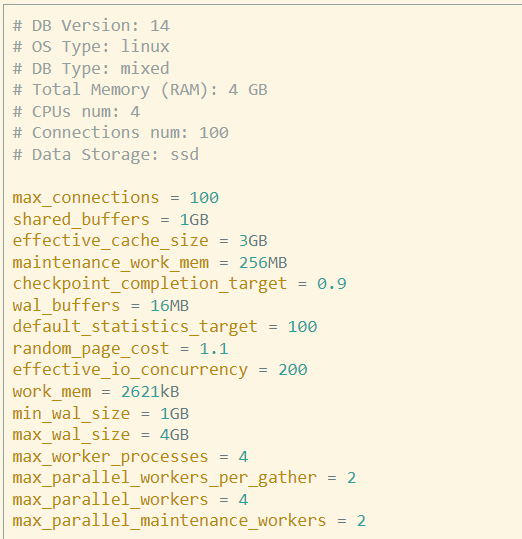
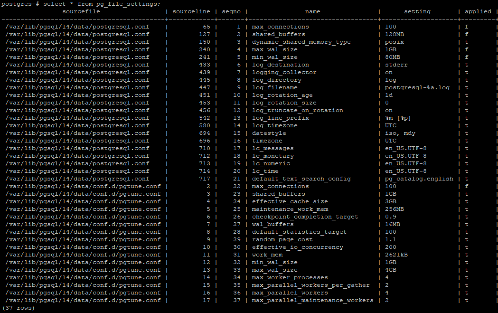
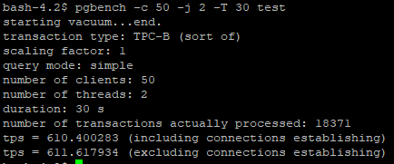
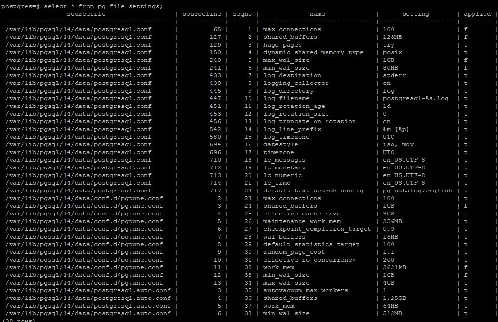

# OTUS_homework7
### Настройка параметров Postgresqll

* Параметры ВМ Яндекс  
DB Version: 14  
OS Type: linux  
DB Type: mixed  
Total Memory (RAM): 4 GB  
CPUs num: 4  

* Вот что рекомендует PGTune  

* Скопируем параметры в файл и добавим директорию /var/lib/pgsql/14/data/conf.d в postgresql.conf в include

* Сейчас настройки у нас:  

* При тестировании результат:  

Увеличим shared_buffers до 1.25GB, т.к. у нас на сервере больше ничего нет кроме кластера postgresql. При дальнейшем его увеличинии не было положительной динамики. 

Изменим work_mem, т.к. нам выдало странные значения в 2621kB. По рекомендациям где-то его ставят из расчета RAM/32..64. Но у нас не такая нагруженная база и выше значения 125MB различий нет. 

Так же снижение значений checkpoint_completion_target снизило tps, оставим его 0.9.  

random_page_cost для SSD лучше ставить в значения 1.1...1.3. Оставим его 1.1, seq_page_cost - 1.  

effective_io_concurrency = 200 для SSD.  

Уберем:  
max_worker_processes = 4  
max_parallel_workers_per_gather = 2  
max_parallel_workers = 4  
max_parallel_maintenance_workers = 2  

Т.к. эти параметры задаются при инициализации, понять их уже "поздно".

Минимальный и максимальный рамеры WAL тоже можно уменьшить.

В итоге настройки у нас:

Результат:
tps = 655.807360 (including connections establishing)
tps = 656.929838 (excluding connections establishing)
